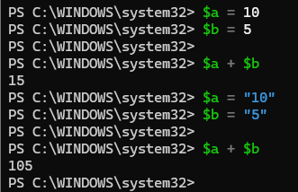
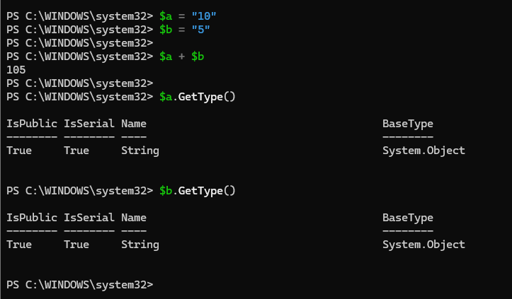
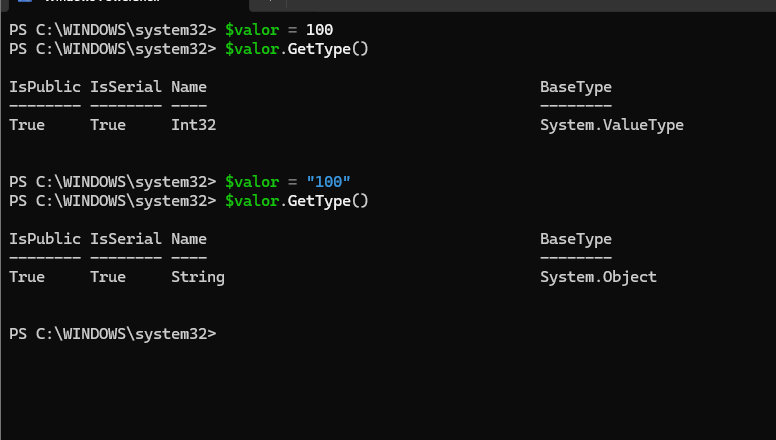
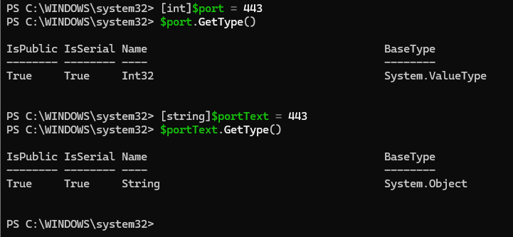

> **Nota**: Els exercicis/pràctiques t'han de servir per a familiarizar-te amb el llenguatge Powershell. Aprofita per a realitzar diverses proves i veure què passa. Documenta també aquestes proves i resultats.
# Tipus de dades

## 1. Identificar tipus

Crea les variables següents:
```powershell
$nom = "Servidor01"
$port = 443
$actiu = $true
$espai = 12.5
```
Consulta el tipus de cadascuna amb:
```powershell
.GetType()
```
Completa una taula com aquesta:

| Variable | Valor        | Tipus |
| -------- | ------------ | ----- |
| $nom     | `Servidor01` |       |
| $port    | `443`        |       |
| $actiu   | $true        |       |
| $espai   | `12.5`       |       |


## 2. Número o text?

Executa:
```powershell
$a = 10
$b = 5

$a + $b
```
Després:
```powershell
$a = "10"
$b = "5"

$a + $b
```
Respon:

- Quin resultat obtens en cada cas?


- Per què no és el mateix?
Mostra després el contingut de cadascuna de les variables.

Per què? Perquè en el primer cas 10 i 5 són números, així que + fa una suma. En el segon cas, "10" i "5" són textos (String), així que + els concatena, és a dir, els uneix.


- Quin tipus tenen $a i $b en cada cas?



## 3. Canviar el tipus d'una variable

Executa:
```powershell
$valor = 100
```
Consulta:
```powershell
$valor.GetType()
```
Ara executa:
```powershell
$valor = "100"
```
i torna a consultar:
```powershell
$valor.GetType()
```
Respon:
Primer he creat la variable amb el valor numèric `100`:


$valor = 100

He consultat el seu tipus:

$valor.GetType()

El tipus obtingut és Int32.

Després he canviat el valor de la variable per un text:

$valor = "100"

I he tornat a consultar el tipus:

$valor.GetType()

Ara el tipus obtingut és String.




**Ha canviat el valor? Ha canviat el tipus?**

El valor continua sent 100, però ha canviat el tipus de la variable.

Abans era un número (Int32) i després és un text (String).

## 4. Tipus explícits

Executa:
```powershell
[int]$port = 443
```
Comprova el tipus:
```powershell
$port.GetType()
```
Ara prova:
```
[string]$portText = 443
```
Consulta també:
```powershell
$portText.GetType()
```

He creat la variable `$port` indicant explícitament que és de tipus `int`:

[int]$port = 443

He comprovat el seu tipus:

$port.GetType()

El resultat és Int32.

Després he creat la variable $portText indicant que és de tipus string:

[string]$portText = 443

He comprovat el seu tipus:

$portText.GetType()

El resultat és String.




Respon:

**Tot i que visualment els dos valors semblen `443`, són del mateix tipus?**

Tot i que visualment els dos valors semblen 443, no són del mateix tipus.

$port és de tipus Int32, és a dir, un número.
$portText és de tipus String, és a dir, un text.

Per tant, el tipus d'una variable es pot indicar explícitament amb [int], [string], etc.


## 5. Booleans

Crea:
```powershell
$serveiActiu = $true
$servidorDisponible = $false
```
Consulta els tipus.

Després mostra un missatge amb:
```
Write-Host "Servei actiu: $serveiActiu"
Write-Host "Servidor disponible: $servidorDisponible"
```
## 6. General

Crea variables per representar un servidor amb aquesta informació:
```
Nom: SRV-WEB01
Port: 443
Espai lliure: 125.7 GB
Actiu: True
```
Després:

1. mostra el valor de totes les variables;
2. consulta el tipus de cadascuna;
3. indica quin tipus de dada has utilitzat per cada valor.